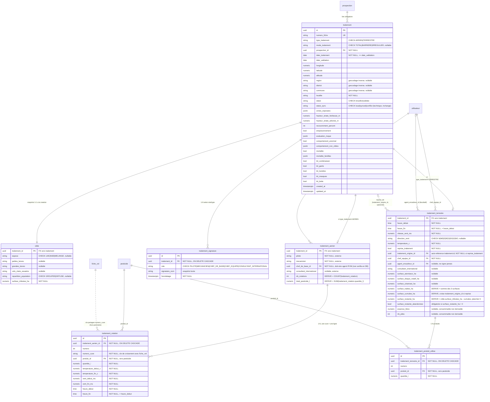

# Modèle de données `traitement` (ex-CRT) v2.0

Ce document capture le modèle cible discuté en revue de la PR #55 et implémenté dans
`backend/alembic/versions/0010_add_crt_tables.py`. La migration `0010` remplace la
table plate `crt` (~70 colonnes, aucun discriminant) par une spécialisation par type
de traitement (aérien/terrestre), issue du cahier des charges v2.0.

## Pourquoi `crt` → `traitement`

Le cahier des charges parle de « traitement aérien/terrestre » dans toutes les
sections fonctionnelles — `CRT` ne désigne que le *compte-rendu* (le document), alors
que la ligne en base représente l'événement de traitement lui-même. `numero_fiche`
(l'identifiant lisible affiché à l'utilisateur, ex. anciennement `numero_crt`) reste
inchangé dans son usage, seul le nom de table change.

Impacts déjà appliqués dans la migration `0010` :
- `audit_log.fiche_type` : `'crt'` → `'traitement'`.
- `CONTEXT.md` : glossaire et schéma mis à jour.

## Modèle ER

## Décisions de conception

- **Spécialisation Method 1** (`traitement` + sous-tables disjointes/totales) plutôt
  qu'une table plate — `type_traitement` est disjoint et obligatoire.
- **Champs dérivés stockés** (`nb_rotations`, `total_pesticide_l`, `surface_traitee_ha`,
  `surface_cumulee_ha`, `surface_restante_ha`) : jamais saisis, mais stockés, car le
  mode hors-ligne + le verrouillage post-validation le justifient. Un seul chemin
  d'écriture applicatif doit les alimenter (non couvert par cette migration — schema
  only, comme le reste du module `traitement`).
- **`moyens_traitement`** (choix multiple, section 4 du formulaire) n'est pas modélisé
  séparément : entièrement dérivable des colonnes `surface_atomiseur_ha`/
  `surface_disque_rotatif_ha`/`surface_ulvamast_ha` non nulles sur `traitement_terrestre`.
- **`essence_litres`/`nb_piles`** sont conservés sur `traitement_terrestre` : ce sont
  des consommables non dérivables des surfaces (pas de doublon avec les colonnes
  ci-dessus), contrairement aux anciens compteurs `nb_agents_*`/`nb_atomiseur`/
  `nb_disque_rotatif`/`nb_poudreuse_manuelle` de la v1 qui, eux, dupliquaient
  `crt_personnel`/`crt_materiel` et ont été supprimés.
- **`crt_personnel`/`crt_materiel` supprimées** : remplacées par les FK de rôle
  explicites (`chef_de_base_id`, `pilote`, `mecanicien`, `chef_equipe_id`,
  `agent_encadreur_id`, `consultant_international`) + `traitement_signature`.
- **`matiere_active`** déplacé de `crt` vers `pesticide` (`pesticide_id → matiere_active`
  est une FD réelle du domaine : propriété du produit, pas de l'événement de traitement).
- **Sections 6-11 du formulaire physique** (zones exposées, végétation, empoisonnement,
  évaluation du risque, comportement anormal, mortalité) restent sur `traitement`
  inchangées : elles ne posaient pas de problème ER et sont hors du périmètre discuté
  en revue.
- **`traitement_origine_id`** (reprise de traitement) référence `traitement.id` et
  pointe vers la **fiche précédente immédiate** (liste chaînée), pas la fiche racine
  de la zone — tranché après revue le 2026-08-05. `surface_cumulee_ha` se calcule donc
  en remontant la chaîne côté application.
- **`VARCHAR(n)` plutôt que `Text()` pour les colonnes bornées/à domaine contraint**
  (`type_traitement`, `statut`, `espece`, `role`, noms de personnes, etc.) — écart
  assumé par rapport à la convention `Text()` des migrations `0001`-`0009`, pour la
  portabilité vers un SGBD qui traite les deux différemment (ex. MySQL : pas de
  valeur par défaut sur `TEXT`, indexation par préfixe obligatoire). Les champs
  réellement en texte libre non borné (ex. `empoisonnement_autre`) restent en
  `Text()`. Décision prise en revue le 2026-08-05 ; les migrations antérieures ne
  sont pas rétro-alignées (hors périmètre).

## Points ouverts (hors périmètre de cette migration)

- §7.2 (source CDG) — clé `numero_cuve` partagée avec la future `fiche_vol` : simple
  convention de saisie documentée par `COMMENT ON COLUMN`, pas une FK garantie en base
  (la table `fiche_vol` n'existe pas encore).
- Contrainte "`chef_de_base_id` doit être un agent IFVM" : non vérifiable par un CHECK
  inter-lignes, à valider côté application.
- Aucun modèle ORM (SQLAlchemy), schéma Pydantic ni router FastAPI n'est ajouté par
  cette migration — comme la `0010` d'origine, ce travail reste schema-only ; la
  couche applicative est une itération future.
