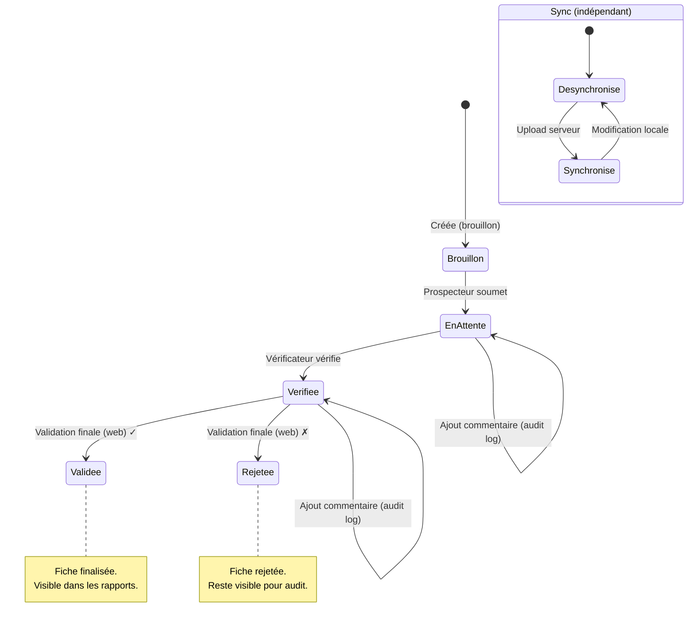
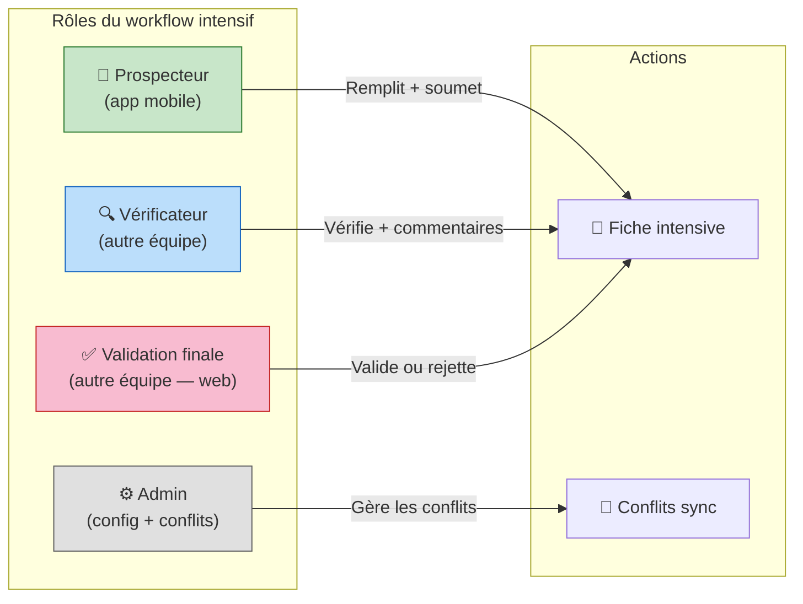
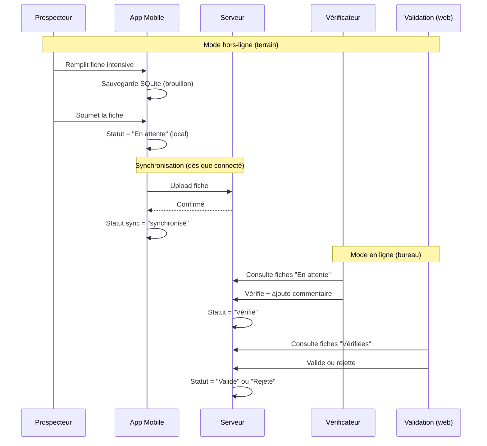

# Flux utilisateur — Prospection Intensive

## Vue d'ensemble

```mermaid
flowchart TD
    subgraph CAMPAGNE["Campagne en cours (une seule)"]
        direction TB
    end

    subgraph MOBILE["App Mobile — Prospecteur"]
        direction TB
        A[Clique +] --> B[Choix type: Intensive]
        B --> C[Choix station fixe]
        C --> D[Formulaire pré-rempli]
        D --> E[Remplit les données]
        E --> F[Soumet la fiche]
    end

    subgraph SYNC["Synchronisation (offline/online)"]
        direction TB
        S1[Statut sync: synchronisé] 
        S2[Statut sync: désynchronisé]
    end

    subgraph VALIDATION["Workflow de validation"]
        direction TB
        G[En attente] --> H{Vérificateur<br/>autre équipe}
        H -->|Vérifie| I[Vérifié]
        H -->|Commentaires<br/>(audit log)| H
        I --> J{Validation finale<br/>autre équipe — web}
        J -->|Approuve| K[Validé ✓]
        J -->|Rejette| L[Rejeté ✗]
    end

    CAMPAGNE --> MOBILE
    MOBILE --> SYNC
    F --> G
    SYNC -.->|indépendant| VALIDATION

    style CAMPAGNE fill:#e8f5e9,stroke:#2e7d32
    style MOBILE fill:#e3f2fd,stroke:#1565c0
    style SYNC fill:#fff3e0,stroke:#ef6c00
    style VALIDATION fill:#fce4ec,stroke:#c62828
```

## Machine à états — Fiche intensive



## Acteurs et responsabilités



## Flux offline → online


