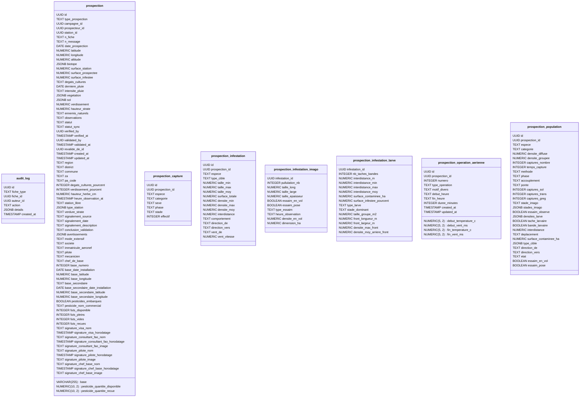
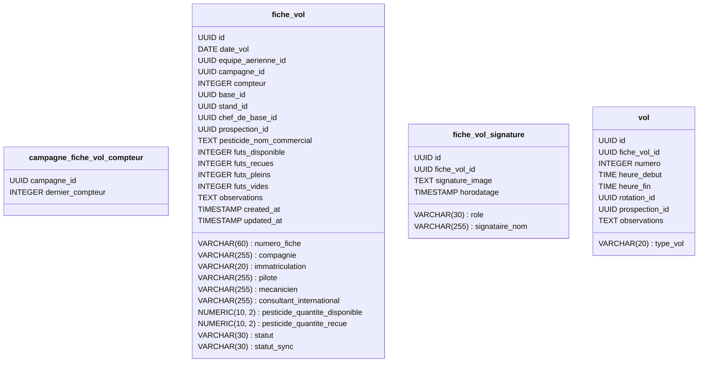
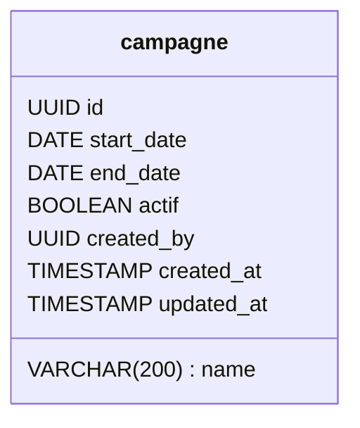
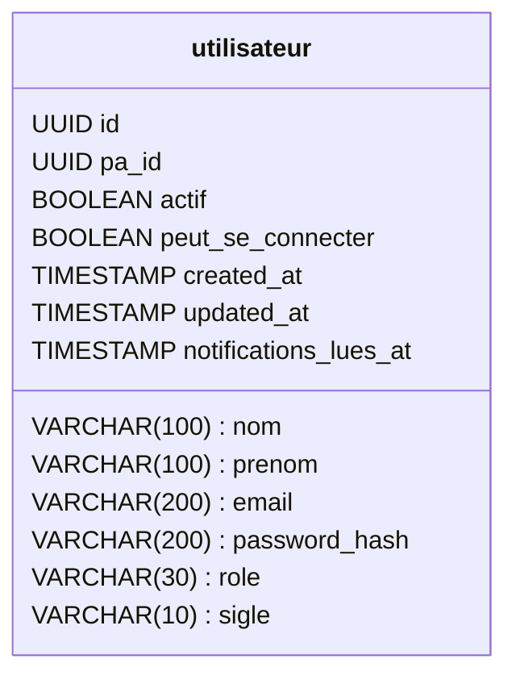

# Schema de la base de donnees -- IFVM

Genere automatiquement par `backend/scripts/generate_schema_doc.py` a partir des modeles SQLAlchemy (source de verite) -- ne pas editer a la main. Une PR qui change les modeles/migrations doit relancer le script et committer le resultat (`python scripts/generate_schema_doc.py`), verifie en CI par `generate_schema_doc.py --check`.

## Referentiel

```mermaid
classDiagram
direction BT
class aeronef {
   UUID id
   VARCHAR(20) immatriculation
   TEXT societe
   NUMERIC(8, 2) volume_cuve_l
   BOOLEAN actif
   TIMESTAMP created_at
   TIMESTAMP updated_at
}
class base_aerienne {
   UUID id
   UUID parent_base_id
   UUID equipe_id
   TEXT numero
   TEXT localite
   NUMERIC(11, 8) longitude
   NUMERIC(10, 8) latitude
   NUMERIC(8, 2) altitude
   BOOLEAN actif
   TIMESTAMP created_at
   TIMESTAMP updated_at
}
class code_stade {
   UUID id
   TEXT code
   TEXT categorie
   TEXT sexe
   TEXT espece
   TEXT libelle
   INTEGER ordre
   BOOLEAN actif
   TIMESTAMP created_at
   TIMESTAMP updated_at
}
class commune {
   UUID id
   TEXT nom
   UUID district_id
}
class culture {
   UUID id
   TEXT code
   TEXT nom
   BOOLEAN actif
   TIMESTAMP created_at
   TIMESTAMP updated_at
}
class district {
   UUID id
   TEXT nom
   UUID region_id
}
class equipe_aerienne {
   UUID id
   TEXT nom
   UUID chef_de_base_id
   TEXT pilote
   TEXT mecanicien
   TEXT consultant_international
   UUID aeronef_id
   BOOLEAN actif
   TIMESTAMP created_at
   TIMESTAMP updated_at
}
class equipe_aerienne_membre {
   UUID id
   UUID equipe_aerienne_id
   TEXT nom
   TIMESTAMP created_at
}
class equipe_terrestre {
   UUID id
   TEXT nom
   UUID chef_equipe_id
   BOOLEAN actif
   TIMESTAMP created_at
   TIMESTAMP updated_at
}
class equipe_terrestre_membre {
   UUID id
   UUID equipe_terrestre_id
   TEXT nom
   TIMESTAMP created_at
}
class lieu_aerien {
   UUID id
   TEXT type_lieu
   TEXT nom
   NUMERIC(10, 8) latitude
   NUMERIC(11, 8) longitude
   NUMERIC(8, 2) altitude
   UUID equipe_aerienne_id
   BOOLEAN actif
   TIMESTAMP created_at
   TIMESTAMP updated_at
}
class pesticide {
   UUID id
   TEXT code
   TEXT nom
   TEXT matiere_active
   TEXT dose_reference
   TEXT type_produit
   BOOLEAN actif
   TIMESTAMP created_at
   TIMESTAMP updated_at
}
class poste_acridien {
   UUID id
   TEXT code
   TEXT nom
   UUID za_id
   UUID equipe_terrestre_id
   BOOLEAN actif
   TIMESTAMP created_at
   TIMESTAMP updated_at
}
class region {
   UUID id
   TEXT nom
}
class stade {
   TEXT code
   TEXT libelle
   BOOLEAN actif
   TIMESTAMP created_at
   TIMESTAMP updated_at
}
class stand_remplissage {
   UUID id
   TEXT numero
   TEXT localite
   NUMERIC(11, 8) longitude
   NUMERIC(10, 8) latitude
   NUMERIC(8, 2) altitude
   UUID equipe_aerienne_id
   BOOLEAN actif
   TIMESTAMP created_at
   TIMESTAMP updated_at
}
class station_fixe {
   UUID id
   TEXT code
   TEXT nom
   UUID pa_id
   NUMERIC latitude
   NUMERIC longitude
   NUMERIC altitude
   UUID commune_id
   BOOLEAN actif
   TIMESTAMP created_at
   TIMESTAMP updated_at
}
class zone_anti_acridien {
   UUID id
   TEXT code
   TEXT nom
   BOOLEAN actif
   TIMESTAMP created_at
   TIMESTAMP updated_at
}
```



## Prospection



## Traitement

```mermaid
classDiagram
direction BT
class cible {
   UUID traitement_id
   VARCHAR(10) espece
   VARCHAR(50) petites_larves
   VARCHAR(50) grandes_larves
   VARCHAR(50) vols_clairs_essaims
   VARCHAR(30) repartition_population
   NUMERIC(10, 2) surface_infestee_ha
   NUMERIC(10, 2) petites_larves_lmc
   NUMERIC(10, 2) petites_larves_nse
   NUMERIC(10, 2) grandes_larves_lmc
   NUMERIC(10, 2) grandes_larves_nse
   NUMERIC(10, 2) densite_diffuse_lmc
   NUMERIC(10, 2) densite_groupee_lmc
   NUMERIC(10, 2) densite_diffuse_nse
   NUMERIC(10, 2) densite_groupee_nse
}
class traitement {
   UUID id
   UUID prospection_id
   VARCHAR(50) numero_fiche
   VARCHAR(10) type_traitement
   VARCHAR(30) mode_traitement
   DATE date_traitement
   DATE date_validation
   VARCHAR(255) localite
   VARCHAR(100) region
   VARCHAR(100) district
   VARCHAR(100) commune
   NUMERIC(10, 8) latitude
   NUMERIC(11, 8) longitude
   NUMERIC(8, 2) altitude
   INTEGER nb_agents_permanents
   INTEGER nb_agents_temporaires
   INTEGER nb_personnel_local
   INTEGER moyens_atomiseur_nb
   NUMERIC(10, 2) moyens_essence_litres
   INTEGER moyens_disque_rotatif_nb
   INTEGER moyens_piles_nb
   INTEGER moyens_ulvamast_nb
   INTEGER kit_combinaison
   INTEGER kit_gants
   INTEGER kit_lunettes
   INTEGER kit_masques
   INTEGER kit_botte
   JSONB zones_exposees
   NUMERIC(5, 2) hauteur_strate_herbeuse_m
   NUMERIC(5, 2) hauteur_strate_arboree_m
   INTEGER recouvrement_percent
   BOOLEAN empoisonnement
   VARCHAR(30) empoisonnement_type
   VARCHAR(30) empoisonnement_mode
   TEXT empoisonnement_autre
   JSONB evaluation_risque
   BOOLEAN comportement_anormal
   JSONB comportement_non_cibles
   BOOLEAN mortalite
   JSONB mortalite_familles
   TEXT observations
   VARCHAR(30) statut
   VARCHAR(30) statut_sync
   TIMESTAMP created_at
   TIMESTAMP updated_at
}
class traitement_aerien {
   UUID traitement_id
   UUID chef_de_base_id
   VARCHAR(255) pilote
   VARCHAR(255) mecanicien
   VARCHAR(255) consultant_international
   VARCHAR(255) base_principale
   VARCHAR(255) stand
   VARCHAR(255) base_secondaire
   DATE stand_date_installation
   DATE base_secondaire_date_installation
   TEXT immatricule_aeronef
   INTEGER nb_rotations
   NUMERIC(10, 2) total_pesticide_l
   NUMERIC(10, 2) total_pesticide_kg
   NUMERIC(10, 2) surface_traitee_ha
   NUMERIC(10, 2) surface_restante_ha
   NUMERIC(10, 2) pesticide_recu_l
   NUMERIC(10, 2) pesticide_stock_restant_l
   NUMERIC(5, 2) taux_mortalite_pourcent
   NUMERIC(5, 2) evaluation_efficacite_heures_apres
   VARCHAR(50) methode_evaluation_efficacite
   BOOLEAN reprise_traitement
   UUID traitement_origine_id
   NUMERIC(10, 2) surface_cumulee_ha
}
class traitement_bloc {
   UUID id
   UUID traitement_aerien_id
   INTEGER numero
   VARCHAR(60) nom
   VARCHAR(255) localite
   NUMERIC(10, 2) surface_theorique_ha
   NUMERIC(10, 2) surface_reelle_ha
   NUMERIC(10, 2) surface_protegee_ha
   NUMERIC(10, 2) surface_traitee_ha
   NUMERIC(6, 2) largeur_andain_m
   NUMERIC(6, 2) interpasse_m
   NUMERIC(5, 2) hauteur_vol_min_m
   NUMERIC(5, 2) hauteur_vol_max_m
   TEXT observation
}
class traitement_evaluation_risque_population {
   UUID id
   UUID traitement_id
   INTEGER ordre
   TEXT habitat_proche
   NUMERIC(6, 2) distance_km
   BOOLEAN sensibilisation
}
class traitement_produit_utilise {
   UUID id
   UUID traitement_terrestre_id
   INTEGER numero
   UUID produit_id
   NUMERIC(10, 2) quantite_l
   TEXT nom_commercial
}
class traitement_rotation {
   UUID id
   UUID traitement_aerien_id
   UUID bloc_id
   INTEGER numero
   VARCHAR(50) numero_cuve
   UUID produit_id
   NUMERIC(10, 2) quantite
   VARCHAR(2) unite
   NUMERIC(10, 2) surface_ha
   NUMERIC(5, 2) temperature_debut_c
   NUMERIC(5, 2) temperature_fin_c
   NUMERIC(5, 2) vent_debut_ms
   NUMERIC(5, 2) vent_fin_ms
   TIME heure_debut
   TIME heure_ouverture_vanne
   TIME heure_fermeture_vanne
   TIME heure_fin
   TEXT nom_commercial
}
class traitement_signature {
   UUID id
   UUID traitement_id
   VARCHAR(30) role
   VARCHAR(255) signataire_nom
   TEXT signature_image
   TIMESTAMP horodatage
}
class traitement_terrestre {
   UUID traitement_id
   TIME heure_debut
   TIME heure_fin
   NUMERIC(5, 2) vitesse_vent_ms
   VARCHAR(2) direction_vent
   NUMERIC(5, 2) temperature_c
   NUMERIC(5, 2) taux_mortalite_pourcent
   NUMERIC(5, 2) evaluation_efficacite_heures_apres
   VARCHAR(50) methode_evaluation_efficacite
   BOOLEAN reprise_traitement
   UUID traitement_origine_id
   UUID chef_equipe_id
   VARCHAR(255) agent_encadreur
   VARCHAR(255) consultant_international
   NUMERIC(10, 2) surface_atomiseur_ha
   NUMERIC(10, 2) surface_disque_rotatif_ha
   NUMERIC(10, 2) surface_atomiseur_autoporte_ha
   NUMERIC(10, 2) surface_traitee_ha
   NUMERIC(10, 2) surface_cumulee_ha
   NUMERIC(10, 2) surface_restante_ha
   BOOLEAN surface_restante_abandonnee
   TEXT motif_surface_restante_abandonnee
   NUMERIC(10, 2) essence_litres
   INTEGER nb_piles
   VARCHAR(2) pesticide_unite
   NUMERIC(10, 2) total_pesticide_l
   NUMERIC(10, 2) pesticide_recu_l
   NUMERIC(10, 2) stock_initial_l
   NUMERIC(10, 2) pesticide_stock_restant_l
}
```



## Fiche de vol



## Campagne



## Utilisateur



## Relations

```mermaid
classDiagram
base_aerienne  -->  equipe_aerienne : equipe_id:id
base_aerienne  -->  base_aerienne : parent_base_id:id
code_stade  -->  stade : code:code
commune  -->  district : district_id:id
district  -->  region : region_id:id
equipe_aerienne  -->  aeronef : aeronef_id:id
equipe_aerienne  -->  utilisateur : chef_de_base_id:id
equipe_aerienne_membre  -->  equipe_aerienne : equipe_aerienne_id:id
equipe_terrestre  -->  utilisateur : chef_equipe_id:id
equipe_terrestre_membre  -->  equipe_terrestre : equipe_terrestre_id:id
lieu_aerien  -->  equipe_aerienne : equipe_aerienne_id:id
poste_acridien  -->  equipe_terrestre : equipe_terrestre_id:id
poste_acridien  -->  zone_anti_acridien : za_id:id
stand_remplissage  -->  equipe_aerienne : equipe_aerienne_id:id
station_fixe  -->  commune : commune_id:id
station_fixe  -->  poste_acridien : pa_id:id
audit_log  -->  utilisateur : auteur_id:id
prospection  -->  campagne : campagne_id:id
prospection  -->  utilisateur : prospecteur_id:id
prospection  -->  prospection : revalide_de_id:id
prospection  -->  station_fixe : station_id:id
prospection  -->  utilisateur : validated_by:id
prospection  -->  utilisateur : verified_by:id
prospection_capture  -->  prospection : prospection_id:id
prospection_capture  -->  stade : stade:code
prospection_infestation  -->  prospection : prospection_id:id
prospection_infestation_imago  -->  prospection_infestation : infestation_id:id
prospection_infestation_larve  -->  prospection_infestation : infestation_id:id
prospection_operation_aerienne  -->  prospection : prospection_id:id
prospection_population  -->  prospection : prospection_id:id
cible  -->  traitement : traitement_id:id
traitement  -->  prospection : prospection_id:id
traitement_aerien  -->  utilisateur : chef_de_base_id:id
traitement_aerien  -->  traitement : traitement_id:id
traitement_aerien  -->  traitement : traitement_origine_id:id
traitement_bloc  -->  traitement_aerien : traitement_aerien_id:traitement_id
traitement_evaluation_risque_population  -->  traitement : traitement_id:id
traitement_produit_utilise  -->  pesticide : produit_id:id
traitement_produit_utilise  -->  traitement_terrestre : traitement_terrestre_id:traitement_id
traitement_rotation  -->  traitement_bloc : bloc_id:id
traitement_rotation  -->  pesticide : produit_id:id
traitement_rotation  -->  traitement_aerien : traitement_aerien_id:traitement_id
traitement_signature  -->  traitement : traitement_id:id
traitement_terrestre  -->  utilisateur : chef_equipe_id:id
traitement_terrestre  -->  traitement : traitement_id:id
traitement_terrestre  -->  traitement : traitement_origine_id:id
campagne_fiche_vol_compteur  -->  campagne : campagne_id:id
fiche_vol  -->  base_aerienne : base_id:id
fiche_vol  -->  campagne : campagne_id:id
fiche_vol  -->  utilisateur : chef_de_base_id:id
fiche_vol  -->  equipe_aerienne : equipe_aerienne_id:id
fiche_vol  -->  prospection : prospection_id:id
fiche_vol  -->  stand_remplissage : stand_id:id
fiche_vol_signature  -->  fiche_vol : fiche_vol_id:id
vol  -->  fiche_vol : fiche_vol_id:id
vol  -->  prospection : prospection_id:id
vol  -->  traitement_rotation : rotation_id:id
campagne  -->  utilisateur : created_by:id
utilisateur  -->  poste_acridien : pa_id:id
```
